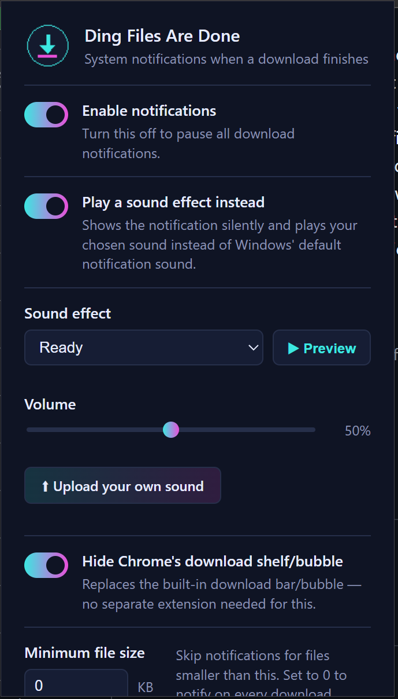

# Ding Files Are Done

*Ding! Files are done downloading.*

A Chrome/Chromium/Brave extension that shows a proper Windows system notification
whenever a download finishes — because the built-in download bubble is easy
to miss and easier to hate. Each notification has a file-type badge icon and
**Open file** / **Show in folder** buttons, with an optional custom sound
effect instead of the default Windows notification sound.

## Features

- **System notification on every completed download**, with the filename,
  full path, and one-click **Open file** / **Show in folder** buttons.
  Clicking the notification body also opens the containing folder.
- **File-type badge icons** — 80 pre-rendered badges (PDF, DOCX, XLSX, ZIP,
  MP4, JSON, and many more), color-coded by category. Unknown extensions get
  a badge drawn on the fly from the file's MIME type, so every file type
  shows something sensible.
- **Sound effects** — silence the default Windows notification sound and
  play your own instead:
  - 10 built-in sounds synthesized live with the Web Audio API (no audio
    files, no licensing baggage)
  - 3 bundled sounds
  - or upload your own audio file (stored locally in your browser, max 5MB)
  - with a volume slider and instant preview
- **Hide Chrome's download shelf/bubble** — built in as an option, so you
  don't need a second extension for that.
- **Minimum file size filter** — skip notifications for tiny files, if that suits your fancy. Personally I wanna be notified of everything, but I was told this could be useful.

## Installation

**From source (unpacked):**

1. Download or clone this repository.
  a. Click the green "Code" button at the top, and choose Download ZIP from the dropdown menu.
  b. Alternatively, click Released on the right side and download the released ZIP file from there.
  c. Unzip the file so you have just the base folder, with all contents inside it, and store the folder somewhere safe (e.g. Documents).
2. Open `chrome://extensions` (or `brave://extensions`).
3. Enable **Developer mode** (top right).
4. Click **Load unpacked** and select the extension's folder.

Requires Chrome/Chromium 116 or newer.

## Privacy

Everything happens locally. This extension:

- does **not** collect, store, or transmit any data anywhere
- makes **no** network requests of any kind
- has **no** access to the contents of any web page

It uses the `downloads` permission solely to detect completed downloads and
to power the Open file / Show in folder buttons; download filenames never
leave your machine. Settings are stored in your browser's extension storage
(synced across your own Chrome profile if you use sync). An uploaded sound
is stored only in local extension storage on your machine.

## Customization & development

- Adding bundled sounds or regenerating/extending the file-type icon set:
  see [`notes.txt`](notes.txt).
- Sound sources and licenses for bundled audio: see
  [`ATTRIBUTIONS.md`](ATTRIBUTIONS.md).
- Icons are generated by [`make_icons.py`](make_icons.py) (Python 3 +
  Pillow); output is deterministic.

## License

Copyright (C) 2026 Railblade

This program is free software: you can redistribute it and/or modify it
under the terms of the **GNU Affero General Public License v3.0** as
published by the Free Software Foundation.

This program is distributed in the hope that it will be useful, but WITHOUT
ANY WARRANTY; without even the implied warranty of MERCHANTABILITY or
FITNESS FOR A PARTICULAR PURPOSE. See the [LICENSE](LICENSE) file for
details.